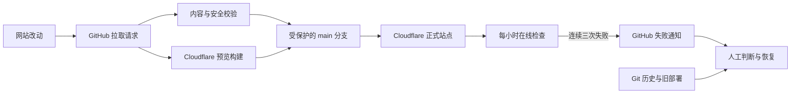

# AI 热点追踪免费安全防护设计

## 背景

「AI 热点追踪」是部署在 Cloudflare Pages 上的 Hugo 静态网站，源码保存在公开 GitHub 仓库。网站没有数据库、后台登录、用户账户或服务端业务接口。这种结构本身攻击面较小，主要风险集中在 GitHub、Cloudflare 与邮箱账户被盗，恶意改动进入主分支，错误版本发布后未被及时发现，以及出事后缺少明确恢复步骤。

网站已经具备 Cloudflare Pages 托管、受保护的 `main` 分支、Cloudflare 构建检查、Git 历史记录和 `static/_headers` 安全响应头。本设计在这些基础上补齐免费、低维护成本的预防、发现和恢复能力，不改变网站的静态架构。

## 目标与成功标准

本次工作的目标不是承诺网站绝对不会被攻击，而是让常见攻击难以奏效，让异常能够被发现，并让站点在可控时间内恢复。

完成后需要满足以下标准。

- 所有进入 `main` 的改动都必须通过拉取请求、仓库校验和 Cloudflare Pages 构建检查。
- GitHub、Cloudflare 和登录邮箱均完成双重验证或通行密钥设置，并安全保存恢复码。
- 公开仓库启用密钥泄漏检测、推送保护和私密漏洞报告。
- 网站每小时自动检查一次首页、搜索页、站点地图和关键安全响应头，也可以手动触发检查。
- 单次网络波动不会立即报警；同一次检查连续三次失败才判定失败。
- 发现损坏版本后，在账户访问权限仍然可用的前提下，目标是在 30 分钟内恢复可用页面。
- 恢复步骤使用中文记录，非开发者也能按顺序完成。

## 威胁范围

本设计处理以下现实风险。

- 钓鱼、弱密码或会话泄漏导致 GitHub、Cloudflare、邮箱账户被盗。
- 协作者、恶意程序或操作失误把危险改动送入主分支。
- 安全响应头、内容格式或必要配置在后续改动中被意外删除。
- Cloudflare 发布了可以构建、但页面不可访问或安全配置缺失的版本。
- 研究人员发现漏洞后只能公开发帖或私聊，导致问题提前扩散。
- 网站损坏后不知道先恢复线上版本还是先修复源码。

免费方案不能保证抵御无限规模的分布式拒绝服务攻击，也不能替代电脑和邮箱本身的安全。Cloudflare、GitHub 或网络运营商的整体故障也不在本站能够修复的范围内。

## 总体结构与数据流

防护流程保持单向、可审计，不允许自动程序直接修改生产站点。

发布前校验负责阻止明显错误进入主分支；Cloudflare 预览负责证明网站可以构建；发布后监控负责发现线上异常；Git 历史和 Cloudflare 旧部署负责恢复。四个部分相互独立，任何一个部分失效都不会获得自动修改其他部分的权限。

## 组件设计

### 账户安全清单

新增一份简短的中文账户安全清单，覆盖 GitHub、Cloudflare 和登录邮箱。每个账户需要开启双重验证或通行密钥，保存离线恢复码，检查并撤销陌生会话、应用授权、API 密钥和访问令牌。

密码、验证码和恢复码不得写入仓库。Codex 只提供操作步骤，最终验证必须由账户所有者亲自在相应平台完成。

### 拉取请求校验

新增一个 GitHub Actions 校验流程，在针对 `main` 的拉取请求和 `main` 更新时运行仓库已有的内容校验与安全校验。该流程使用固定且唯一的检查名称，实施完成后将它加入主分支的必过检查。

安全校验继续验证 `static/_headers` 中的内容安全策略、强制 HTTPS、类型保护、禁止嵌入、来源策略和权限策略。校验脚本必须同时兼容 Windows 的 CRLF 换行和 GitHub Linux 环境的 LF 换行。

当前基线排查确认：`static/_headers` 文件仍然完整存在；`scripts/validate-security.ps1` 的全局规则表达式只接受 LF，文件在 Windows 检出为 CRLF 时会误报失败。这是校验脚本的跨平台兼容问题，不是线上响应头丢失。实施阶段需要先建立可复现检查，再做最小修复。

Cloudflare Pages 现有构建检查继续负责 Hugo 正式构建，不在 GitHub Actions 中重复搭建第二套发布系统。

### 密钥泄漏与漏洞报告

在 GitHub 仓库设置中确认并启用公开仓库可用的密钥扫描与推送保护。检测到受支持的访问令牌或密钥时，GitHub 应阻止推送或产生安全警报。

仓库根目录增加 `SECURITY.md`，说明安全问题不要提交公开 Issue，并引导报告者使用 GitHub 私密漏洞报告。同时在仓库设置中启用私密漏洞报告，确保问题可以只对仓库管理员可见。

### 发布后在线检查

新增一个可手动触发、也按小时运行的 GitHub Actions 工作流。定时安排在整点之外，降低 GitHub Actions 高峰时段延迟的概率。

每次运行检查以下项目。

- 首页返回成功状态，并包含站点的预期标题标记。
- `/search/` 返回成功状态。
- `/sitemap.xml` 返回成功状态，并包含站点地图的基本 XML 标记。
- 首页返回现有设计要求的关键安全响应头。

单项失败后在同一次任务中短暂等待并重试，总计三次。三次都失败才让工作流失败；任何一次成功则本次检查通过。失败只产生 GitHub Actions 红色状态和 GitHub 通知，不执行自动回滚、不改源码，也不自动封禁访问者。

账户所有者需要确认 GitHub 的 Actions 与安全警报邮件通知已经开启。GitHub 定时任务可能延迟；公开仓库连续 60 天没有活动时，定时工作流还可能被暂停。本站持续发布内容时通常不会触发暂停，恢复手册仍需记录重新启用方法。

### 恢复手册

新增中文恢复手册，按事件类型给出固定顺序。

1. 如果只是新版本页面损坏，先在 Cloudflare Pages 的部署记录中回滚到上一个成功的生产部署，恢复访问。
2. 如果 GitHub 源码包含恶意或错误改动，确认影响提交，通过新的拉取请求撤销，不绕过主分支保护。
3. 如果怀疑账户被盗，先修改密码、撤销陌生会话、轮换令牌并确认双重验证，再恢复部署和源码。
4. 恢复后手动运行在线检查，确认页面、站点地图和安全响应头全部通过，并记录事件时间和处置结果。

若 GitHub 账户已经完全失去访问权限，或邮箱也同时被盗，30 分钟恢复目标不再保证成立；此时必须使用平台账户恢复流程。

## 错误处理原则

- 发布前检查失败时阻止合并，并在任务日志中指出失败项目。
- Cloudflare 构建失败时不更新正式站点，继续保留上一成功版本。
- 在线检查失败时只报警，由人判断是短暂网络问题、平台故障还是站点被改坏。
- 不根据单个 IP、对方留言或挑衅自动采取封禁或反击行为。
- 不把任何自动任务设置为拥有修改主分支、回滚生产环境或管理账户安全设置的权限。

## 验证与验收

实施阶段遵循先复现、再修改、最后验证的顺序，并完成以下验收。

- 现有正常内容通过内容校验。
- 安全校验分别面对 LF 与 CRLF 文件时通过；删除全局规则或任一必需安全头时失败。
- 正常拉取请求同时通过仓库校验和 Cloudflare Pages 检查。
- 故意破坏安全配置的测试分支被仓库校验拦截，且不会合并到 `main`。
- 在线检查可以手动成功运行；无效地址、缺失标题、无效站点地图或缺失安全头会让检查失败。
- 正式站点首页、搜索页和站点地图返回正常结果，线上关键安全响应头存在。
- 主分支保护最终同时要求仓库校验和 Cloudflare Pages 检查，不允许强制推送或删除。
- 账户所有者逐项确认双重验证、恢复码、通知邮箱、密钥扫描、推送保护和私密漏洞报告状态。
- 按恢复手册做一次不影响正式站点的桌面演练，能够在 30 分钟内找到旧部署、需要撤销的提交和手动检查入口。

## 实施范围

本次只增加或调整以下内容。

- GitHub 拉取请求校验和每小时在线检查工作流。
- 现有安全校验脚本的 Windows 与 Linux 换行兼容性。
- 私密漏洞报告入口、账户安全清单和中文恢复手册。
- GitHub 仓库的密钥保护、安全报告和必过检查设置。

本次不增加数据库、后台登录、用户系统、Cloudflare Workers、付费防火墙、付费监控、访客追踪或自建服务器；不收集访客 IP；不开发自动反击、自动封禁或自动回滚功能；不修改文章内容、网站主题或视觉布局。

## 官方依据

- [GitHub：受保护分支](https://docs.github.com/en/repositories/configuring-branches-and-merges-in-your-repository/managing-protected-branches/about-protected-branches)
- [GitHub：公开仓库安全功能](https://docs.github.com/en/code-security/getting-started/github-security-features)
- [GitHub：配置私密漏洞报告](https://docs.github.com/en/code-security/how-tos/report-and-fix-vulnerabilities/configure-vulnerability-reporting/configure-for-a-repository)
- [GitHub：定时工作流可能被暂停](https://docs.github.com/en/actions/how-tos/manage-workflow-runs/disable-and-enable-workflows)
- [GitHub：公开仓库 Actions 费用](https://docs.github.com/en/billing/concepts/product-billing/github-actions)
- [Cloudflare Pages：回滚生产部署](https://developers.cloudflare.com/pages/configuration/rollbacks/)

